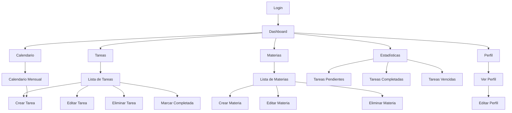
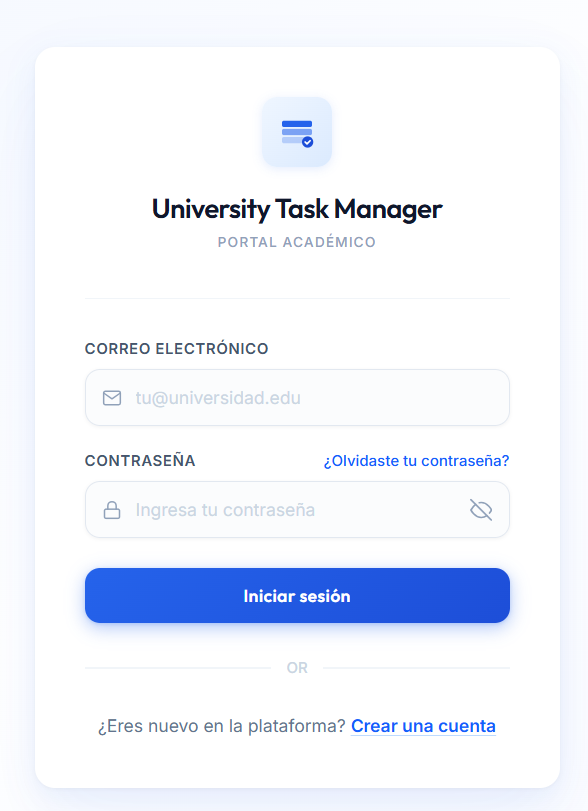
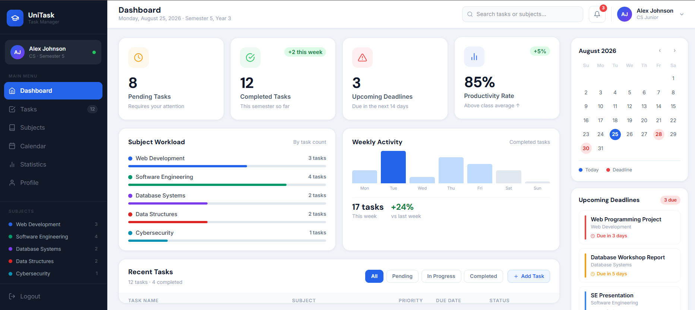
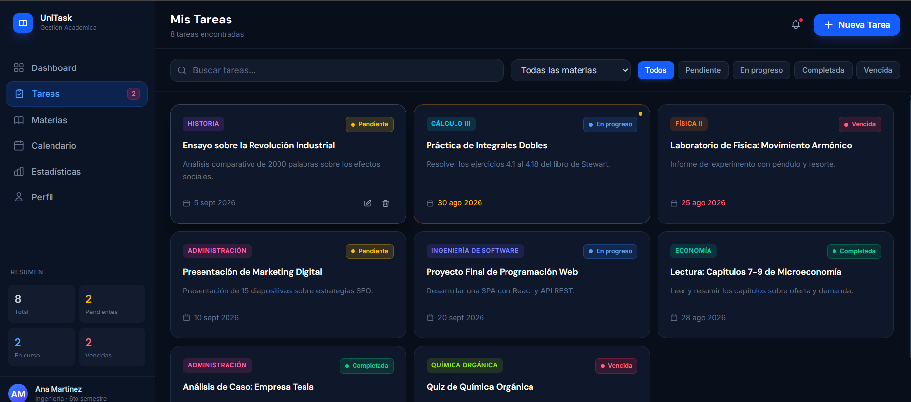
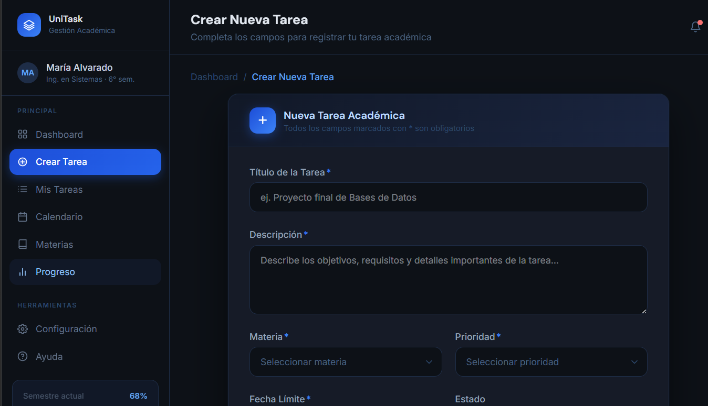
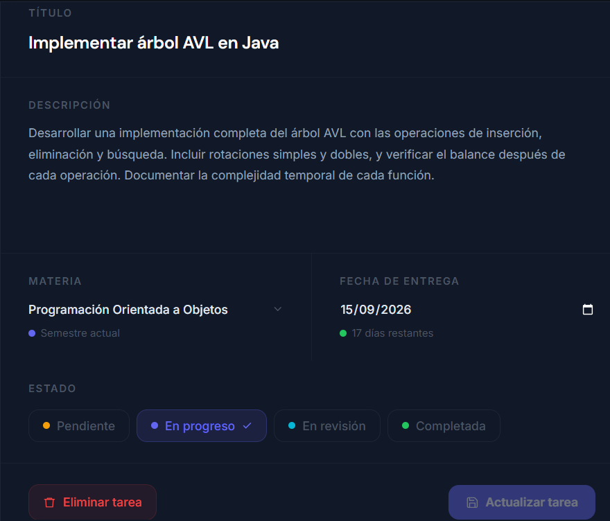
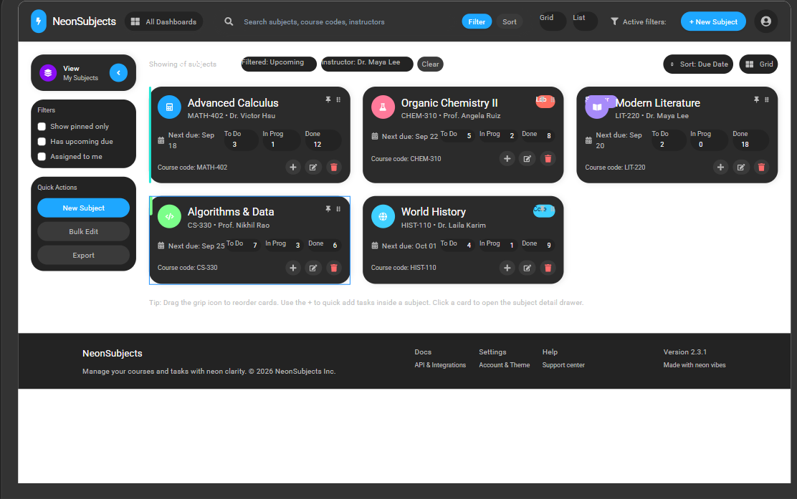
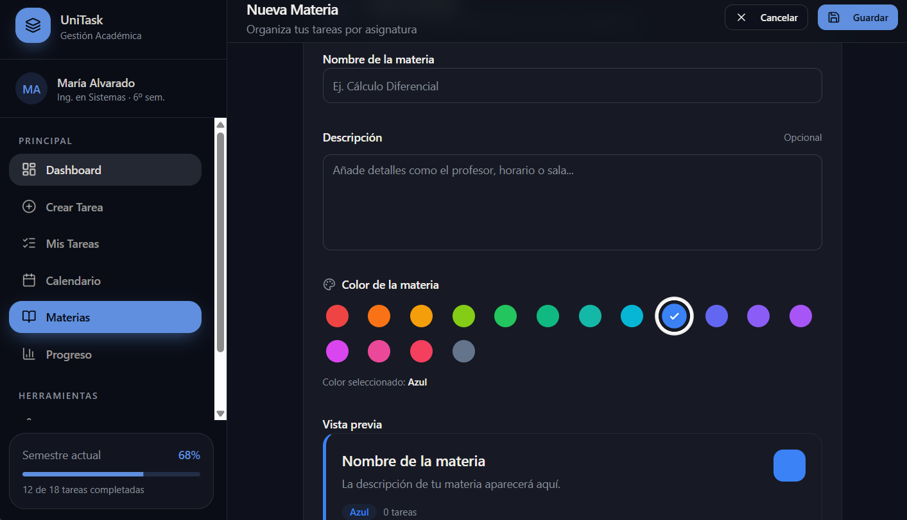
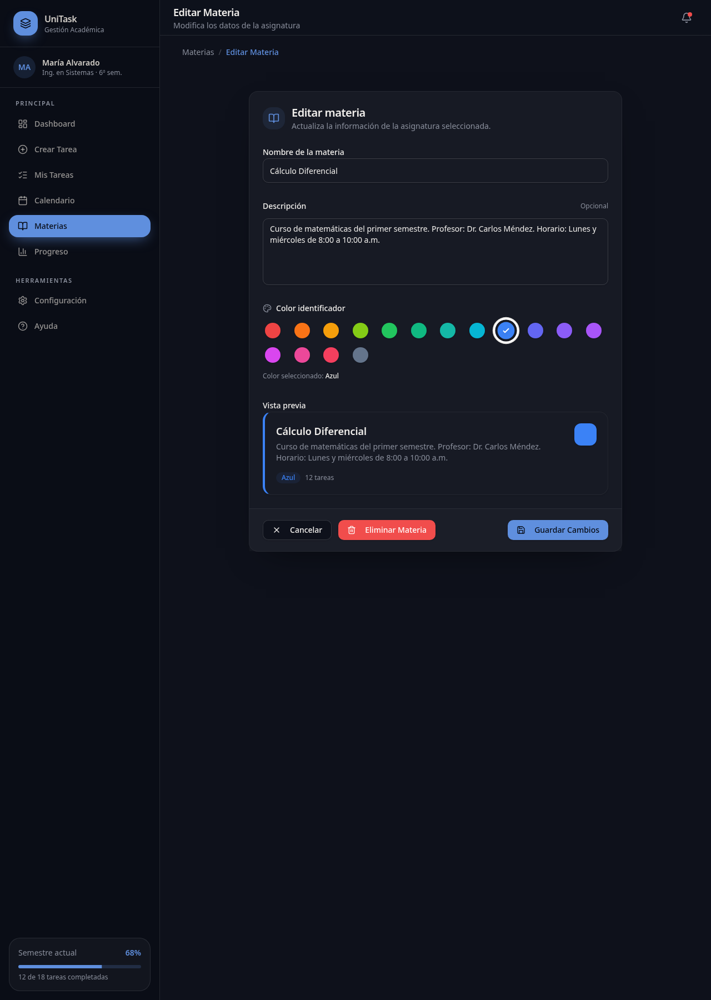

# Gestión de Tareas Universitarias

Documento de definición del proyecto — Programación Web (IF2003), grupo 603

## 1. Descripción general

Gestión de Tareas Universitarias es una plataforma web orientada a estudiantes universitarios que permite organizar, administrar y realizar seguimiento a las actividades académicas de manera centralizada.

La plataforma facilita la gestión de tareas, proyectos, talleres, exposiciones y evaluaciones mediante la creación de materias, asignación de fechas límite y actualización de estados de avance.

Los estudiantes podrán acceder mediante inicio de sesión, registrar sus actividades académicas, clasificarlas por asignatura y consultar su progreso desde un panel principal. Además, contarán con herramientas visuales para identificar tareas próximas a vencer, tareas vencidas y actividades completadas.

La solución busca reducir olvidos, mejorar la planificación académica y proporcionar una visión clara de las responsabilidades pendientes de cada estudiante.

### Conceptos del dominio

**Usuario**
- Persona registrada en el sistema.

**Materia**
- Asignatura asociada al estudiante.
- Ejemplos: Programación Web, Bases de Datos, Ingeniería de Software.

**Tarea**
- Actividad asignada al estudiante.
- Ejemplos: Taller, Proyecto, Exposición, Quiz.

**Estado**
- Situación actual de la tarea.
- Posibles estados: Pendiente, En progreso, Completada, Vencida.

**Fecha límite**
- Fecha máxima para completar una tarea.

## 2. Problema

Los estudiantes universitarios suelen manejar múltiples asignaturas, talleres, proyectos, exposiciones y actividades académicas al mismo tiempo. En muchos casos utilizan agendas físicas, grupos de mensajería o simplemente la memoria para recordar fechas de entrega, lo que puede generar olvidos, retrasos y bajo rendimiento académico.

Actualmente no existe una herramienta centralizada y sencilla que permita a los estudiantes organizar sus tareas académicas, realizar seguimiento a su progreso y recibir recordatorios oportunos.

Por esta razón se propone desarrollar una aplicación web que permita gestionar tareas universitarias de manera eficiente.

## 3. Objetivos

### Objetivo general

Desarrollar una aplicación web para la gestión de tareas universitarias que permita a los estudiantes organizar sus actividades académicas, realizar seguimiento a su progreso y administrar eficientemente sus fechas de entrega.

### Objetivos específicos

- Permitir la creación y almacenamiento de tareas asociadas a materias académicas.
- Reducir el riesgo de olvido de actividades mediante alertas visuales de vencimiento.
- Facilitar la consulta de tareas pendientes desde una única interfaz.
- Permitir la clasificación y filtrado de tareas por materia y estado.
- Proporcionar estadísticas básicas sobre el progreso académico del estudiante.

### Métricas de éxito

- Crear una tarea en menos de 30 segundos.
- Consultar tareas pendientes en menos de 5 segundos.
- Mostrar correctamente el 100% de las tareas asociadas a una materia.
- Permitir identificar tareas próximas a vencer desde el dashboard principal.
- Registrar correctamente cambios de estado de las tareas.

## 4. Stakeholders, actores y roles

### Stakeholders

**Primarios**
- Estudiantes universitarios.

**Secundarios**
- Docentes.
- Coordinadores académicos.
- Instituciones educativas.

### Login

Los estudiantes y administradores acceden mediante correo electrónico y contraseña.

- El estudiante solamente puede gestionar su propia información.
- El administrador puede acceder a funciones de gestión y supervisión del sistema.

### Actores y roles

**Estudiante**

Puede:
- Crear tareas.
- Editar tareas.
- Eliminar tareas.
- Marcar tareas como completadas.
- Consultar tareas pendientes.
- Visualizar tareas por materia.

**Administrador**

Puede:
- Gestionar usuarios.
- Consultar estadísticas globales.
- Administrar materias del sistema.
- Supervisar el funcionamiento de la plataforma.
- Gestionar configuraciones generales.

## 5. Alcance

### Incluye

- Registro e inicio de sesión.
- Gestión de materias.
- Creación de tareas.
- Edición de tareas.
- Eliminación de tareas.
- Asignación de fechas límite.
- Clasificación por asignaturas.
- Gestión de estados.
- Visualización de tareas pendientes y completadas.
- Dashboard principal.

### No incluye

- Integración con plataformas universitarias externas.
- Videollamadas.
- Chat entre usuarios.
- Calificaciones automáticas.
- Aplicación móvil.
- Sincronización con calendarios externos.

## 6. Funcionalidades

### Estudiante

- Registrarse.
- Iniciar sesión.
- Crear tareas.
- Editar tareas.
- Eliminar tareas.
- Consultar tareas.
- Marcar tareas como completadas.
- Gestionar materias.
- Consultar estadísticas personales.

### Administrador

- Gestionar usuarios.
- Consultar estadísticas generales.
- Supervisar el uso de la plataforma.
- Gestionar catálogos del sistema.

## 7. Requerimientos funcionales

| ID | Requerimiento | Rol | Prioridad |
|------|------|------|------|
| RF-01 | El sistema debe permitir el registro de usuarios. | Invitado | Alta |
| RF-02 | El sistema debe permitir iniciar sesión mediante correo y contraseña. | Todos | Alta |
| RF-03 | El sistema debe permitir crear tareas. | Estudiante | Alta |
| RF-04 | El sistema debe permitir editar tareas existentes. | Estudiante | Alta |
| RF-05 | El sistema debe permitir eliminar tareas. | Estudiante | Alta |
| RF-06 | El sistema debe permitir marcar tareas como completadas. | Estudiante | Alta |
| RF-07 | El sistema debe permitir gestionar materias. | Estudiante | Alta |
| RF-08 | El sistema debe mostrar tareas filtradas por estado. | Estudiante | Media |
| RF-09 | El sistema debe mostrar tareas filtradas por materia. | Estudiante | Media |
| RF-10 | El sistema debe mostrar estadísticas de productividad. | Estudiante | Media |
| RF-11 | El sistema debe permitir al administrador administrar usuarios. | Administrador | Alta |
| RF-12 | El sistema debe permitir al administrador consultar estadísticas generales. | Administrador | Media |

## 8. Requerimientos no funcionales

| ID | Categoría | Requerimiento |
|------|------|------|
| RNF-01 | Rendimiento | Las páginas principales deben cargar en menos de 3 segundos. |
| RNF-02 | Rendimiento | Las consultas de tareas deben responder en menos de 2 segundos. |
| RNF-03 | Seguridad | Las contraseñas deben almacenarse cifradas. |
| RNF-04 | Seguridad | Cada usuario solo podrá acceder a su propia información. |
| RNF-05 | Usabilidad | La plataforma debe ser utilizable desde dispositivos móviles con ancho mínimo de 360px. |
| RNF-06 | Compatibilidad | Debe funcionar correctamente en Chrome, Edge y Firefox. |
| RNF-07 | Disponibilidad | El sistema debe estar disponible al menos el 95% del tiempo. |
| RNF-08 | Mantenibilidad | El código debe seguir arquitectura MVC durante el desarrollo. |

## 9. Reglas de negocio

- **RN-01.** Un estudiante debe iniciar sesión para gestionar tareas.
- **RN-02.** Toda tarea debe pertenecer a una materia.
- **RN-03.** Toda tarea debe tener un título.
- **RN-04.** Toda tarea debe tener una fecha límite.
- **RN-05.** Una tarea completada no puede estar en estado pendiente.
- **RN-06.** Las tareas vencidas deben identificarse visualmente.
- **RN-07.** Un estudiante solo puede visualizar sus propias tareas.

## 10. Modelo de datos

### Usuario
- id
- nombre
- correo
- contraseña
- rol

### Materia
- id
- nombre
- descripcion
- usuario_id

### Tarea
- id
- titulo
- descripcion
- fecha_limite
- estado
- materia_id

### Relaciones

- Un usuario tiene muchas materias.
- Una materia pertenece a un usuario.
- Una materia tiene muchas tareas.
- Una tarea pertenece a una materia.

## 11. Pantallas y flujo

### Pantalla 1: Inicio de sesión

**Rol:** Estudiante y Administrador

**Propósito:** Permitir la autenticación de los usuarios mediante correo electrónico y contraseña para acceder a las funcionalidades correspondientes a su rol.

---

### Pantalla 2: Dashboard

**Rol:** Estudiante

**Propósito:** Mostrar un resumen de las tareas pendientes, completadas y próximas a vencer, además de accesos rápidos a las funcionalidades principales.

---

### Pantalla 3: Gestión de tareas

**Rol:** Estudiante

**Propósito:** Permitir la creación, edición, eliminación y consulta de tareas académicas asociadas a las materias registradas.

---

### Pantalla 4: Gestión de materias

**Rol:** Estudiante

**Propósito:** Permitir crear, editar y administrar las materias utilizadas para clasificar las tareas.

---

### Pantalla 5: Estadísticas

**Rol:** Estudiante

**Propósito:** Mostrar indicadores sobre tareas completadas, pendientes y vencidas para facilitar el seguimiento académico.

---

### Pantalla 6: Panel administrativo

**Rol:** Administrador

**Propósito:** Gestionar usuarios registrados y consultar estadísticas generales del sistema.

---

### Flujo del estudiante

Inicio de sesión → Dashboard → Gestión de tareas → Crear/Editar tarea → Dashboard

Inicio de sesión → Dashboard → Gestión de materias → Dashboard

Inicio de sesión → Dashboard → Estadísticas → Dashboard

### Flujo del administrador

Inicio de sesión → Panel administrativo → Gestión de usuarios

Inicio de sesión → Panel administrativo → Estadísticas generales

## 12. Mockup

### Login

Pantalla de autenticación utilizada por estudiantes y administradores. Permite ingresar mediante correo electrónico y contraseña para acceder a las funcionalidades correspondientes a cada rol.

---

### Dashboard

Pantalla principal de la plataforma. Muestra un resumen general de tareas pendientes, tareas completadas y accesos rápidos a las funcionalidades más utilizadas.

---

### Tareas

Permite consultar todas las tareas registradas por el usuario. Desde esta pantalla se pueden visualizar detalles y acceder a las opciones de edición o eliminación.

---

### Crear tarea

Formulario para registrar una nueva tarea académica. Incluye campos para ingresar título, descripción, fecha límite y materia asociada.

---

### Editar tarea

Permite modificar la información de una tarea previamente registrada y actualizar sus datos según las necesidades del usuario.

---

### Lista de materias

Pantalla destinada a la administración de materias. Permite visualizar todas las materias registradas por el estudiante.

---

### Crear materia

Formulario para registrar una nueva materia dentro de la plataforma y utilizarla posteriormente para clasificar tareas académicas.

---

### Editar materia

Permite actualizar la información de una materia previamente creada.

---

### Flujo principal del estudiante

Login → Dashboard → Tareas → Crear tarea

Login → Dashboard → Tareas → Editar tarea

Login → Dashboard → Materias → Crear materia

Login → Dashboard → Materias → Editar materia

## 13. Historias de usuario, casos de uso, restricciones y supuestos

### Historias de usuario

**HU-01**
Como estudiante, quiero crear una tarea para organizar mis actividades académicas y cumplir oportunamente con mis responsabilidades.

**HU-02**
Como estudiante, quiero editar una tarea para corregir o actualizar información cuando sea necesario.

**HU-03**
Como estudiante, quiero eliminar una tarea para mantener mi lista de actividades organizada y actualizada.

**HU-04**
Como estudiante, quiero marcar una tarea como completada para llevar seguimiento de mi progreso académico.

**HU-05**
Como estudiante, quiero asociar tareas a materias para clasificar y organizar mejor mis actividades.

**HU-06**
Como estudiante, quiero visualizar mis tareas pendientes para identificar rápidamente las actividades que debo realizar.

**HU-07**
Como estudiante, quiero recibir alertas visuales sobre tareas próximas a vencer para evitar incumplir fechas de entrega.

**HU-08**
Como estudiante, quiero iniciar sesión con mis credenciales para acceder de forma segura a mi información académica.

**HU-09**
Como administrador, quiero gestionar los usuarios registrados para supervisar el uso correcto de la plataforma.

**HU-10**
Como administrador, quiero consultar estadísticas generales del sistema para conocer el estado y uso de la plataforma.

### Casos de uso

#### UC-01 Iniciar sesión

**Actor:** Estudiante

**Precondición:**
- El usuario debe estar registrado en la plataforma.

**Flujo principal:**
1. El estudiante accede a la pantalla de inicio de sesión.
2. Ingresa su correo electrónico y contraseña.
3. El sistema valida las credenciales.
4. El sistema identifica el rol del usuario.
5. El sistema concede el acceso y redirige al dashboard principal.

**Excepciones:**
- Si el correo no existe, el sistema muestra un mensaje de error.
- Si la contraseña es incorrecta, el sistema rechaza el acceso e informa al usuario.

---

#### UC-02 Crear tarea

**Actor:** Estudiante

**Precondición:**
- El estudiante debe tener una sesión iniciada.
- Debe existir al menos una materia registrada.

**Flujo principal:**
1. El estudiante selecciona la opción "Nueva tarea".
2. Ingresa el título de la tarea.
3. Ingresa una descripción opcional.
4. Selecciona la materia asociada.
5. Define la fecha límite.
6. Guarda la información.
7. El sistema registra la tarea y la muestra en la lista de tareas.

**Excepciones:**
- Si el título está vacío, el sistema muestra un mensaje de error.
- Si no se selecciona una materia, el sistema impide guardar la tarea.

---

#### UC-03 Modificar tarea

**Actor:** Estudiante

**Precondición:**
- El estudiante debe haber iniciado sesión.
- La tarea debe existir y pertenecer al usuario.

**Flujo principal:**
1. El estudiante selecciona una tarea existente.
2. El sistema muestra la información actual.
3. El estudiante modifica los campos deseados.
4. Guarda los cambios.
5. El sistema actualiza la información de la tarea.

**Excepciones:**
- Si la tarea no existe, el sistema informa el error.
- Si el usuario intenta editar una tarea que no le pertenece, el sistema deniega la acción.

---

#### UC-04 Marcar tarea como completada

**Actor:** Estudiante

**Precondición:**
- El estudiante debe haber iniciado sesión.
- La tarea debe existir y encontrarse activa.

**Flujo principal:**
1. El estudiante selecciona una tarea pendiente.
2. Marca la tarea como completada.
3. El sistema actualiza el estado de la tarea.
4. El sistema refleja el cambio en las estadísticas y listados correspondientes.

### Restricciones

**Técnicas**
- Aplicación web.
- Base de datos relacional.
- Acceso mediante navegador web.
- Desarrollo durante el semestre académico.

**Tiempo**
- Entrega dentro del período académico establecido por el curso.

**Alcance académico**
- Proyecto orientado a fines educativos.

### Supuestos

- Se asume que los estudiantes cuentan con acceso a internet y un dispositivo (computador, tablet o celular) con navegador web actualizado.
- Se asume que cada estudiante gestiona su información de forma individual, sin necesidad de compartir tareas o materias con otros usuarios.
- Se asume que el estudiante ingresará y actualizará sus tareas manualmente, sin integración automática con el sistema académico de la universidad.
- Se asume que el sistema se usará durante un periodo académico (semestre), sin necesidad de migrar datos entre periodos distintos.
- Se asume el uso de Bootstrap y Tailwind CSS como frameworks de estilos para la interfaz, según lo indicado por el docente del curso.
- Se asume que, al ser un proyecto con fines educativos, el volumen de usuarios y datos concurrentes será bajo, sin requerir consideraciones de escalabilidad a gran escala.

## Historial de cambios

| Fecha | Cambio realizado | Autor |
|---------|---------|---------|
| 2026-08-22 | Creación inicial del repositorio y estructura base del proyecto. | Equipo |
| 2026-08-22 | Adición de secciones de servicios y contacto. | Equipo |
| 2026-08-22 | Creación del documento SRS inicial. | Equipo |
| 2026-08-29 | Incorporación de imágenes y actualización del documento SRS. | Equipo |
| 2026-09-05 | Reorganización de carpetas del proyecto. | Equipo |
| 2026-09-19 | Adición de carpeta de pantallas para la actividad. | Equipo |
| 2026-09-25 | Conversión del SRS a documento de definición según los requisitos del entregable. | Equipo |
| 2026-09-25 | Adición de requerimientos funcionales, no funcionales, mockups e historias de usuario. | Equipo |
| 2026-09-25 | Reorganización del documento en las 13 secciones oficiales del entregable. | Equipo |

## Referencias

- Documentación oficial de Tailwind CSS, consultada para la implementación de la interfaz según lo solicitado por el docente del curso. Enlace: tailwindcss.com/docs
- Documentación oficial de Bootstrap, consultada para la implementación de la interfaz según lo solicitado por el docente del curso. Enlace: getbootstrap.com/docs

## Declaración de uso de inteligencia artificial

Se utilizó Microsoft Copilot como herramienta de apoyo durante la elaboración de este proyecto.

Su uso se concentró principalmente en:

- Revisión y mejora de la redacción del documento de definición.
- Organización de secciones para ajustarse a los requisitos del entregable.
- Sugerencias para la estructura de requerimientos funcionales y no funcionales.
- Generación de propuestas visuales utilizadas como base para los mockups de la plataforma.

La idea del proyecto, la definición del problema, los objetivos, las funcionalidades, las decisiones de alcance y la estructura general de la aplicación fueron definidas por los integrantes del equipo.

Las sugerencias proporcionadas por la herramienta fueron revisadas, adaptadas y modificadas antes de incorporarse al documento final.