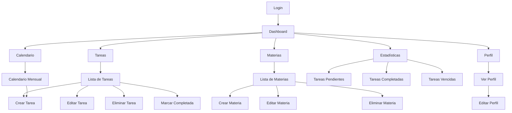
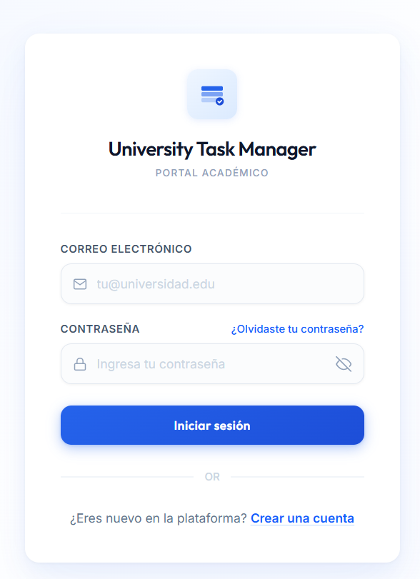
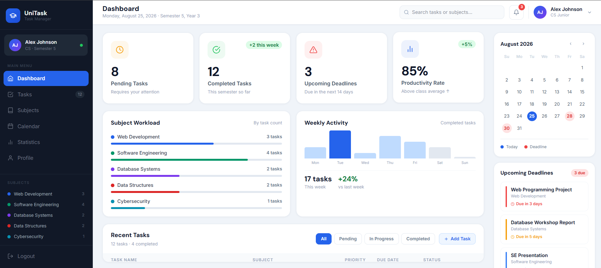
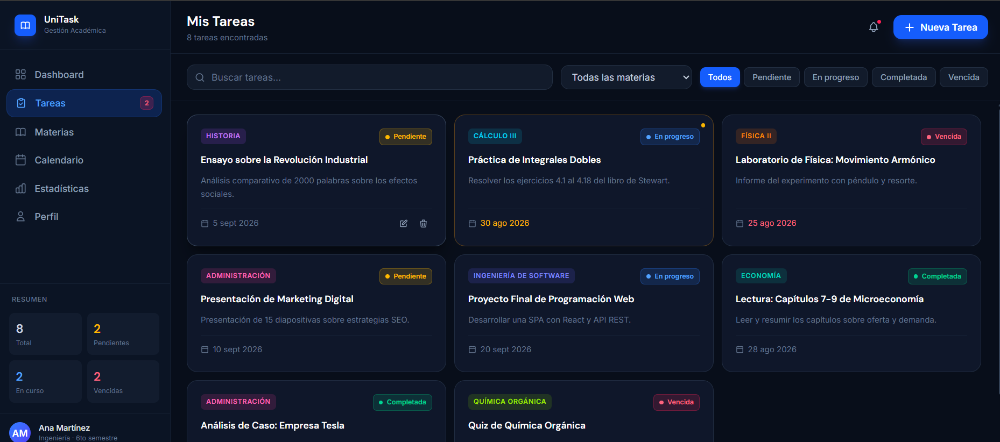
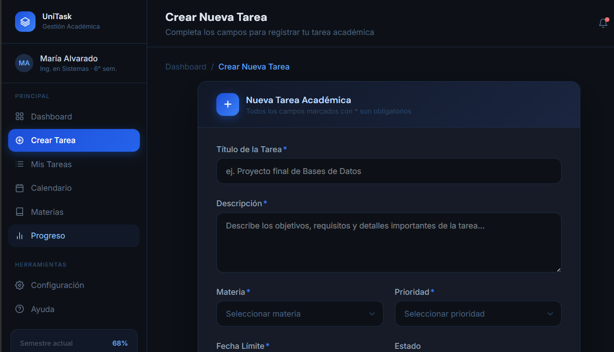
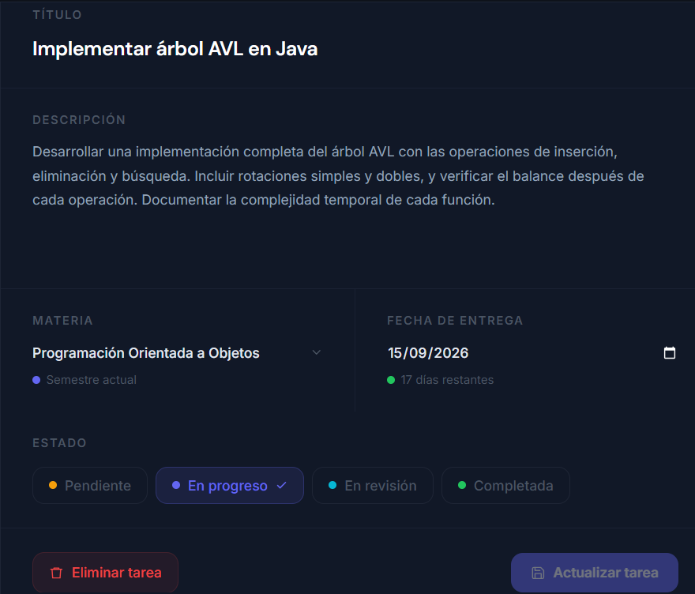
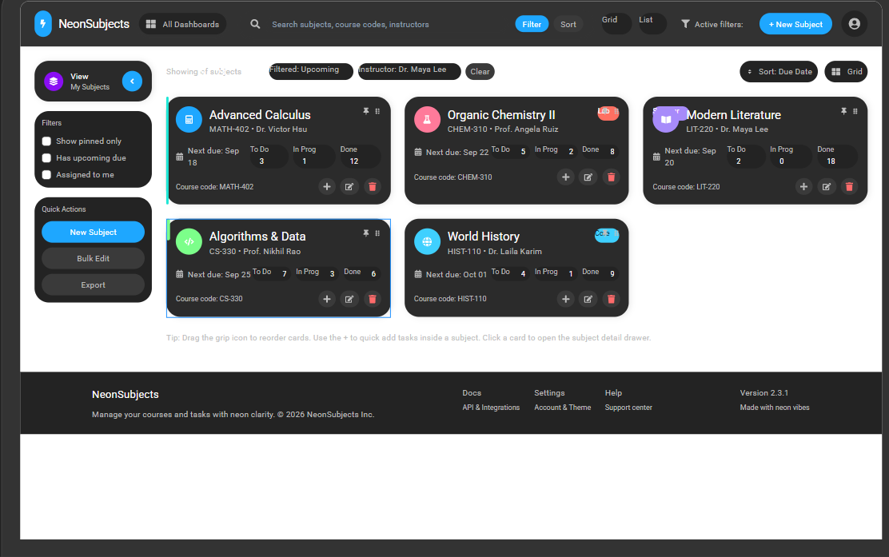
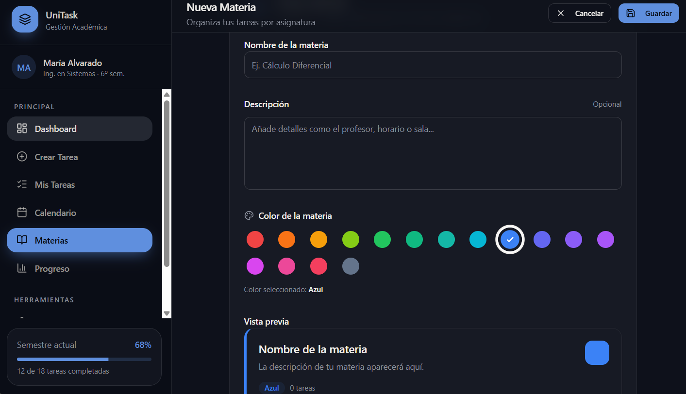
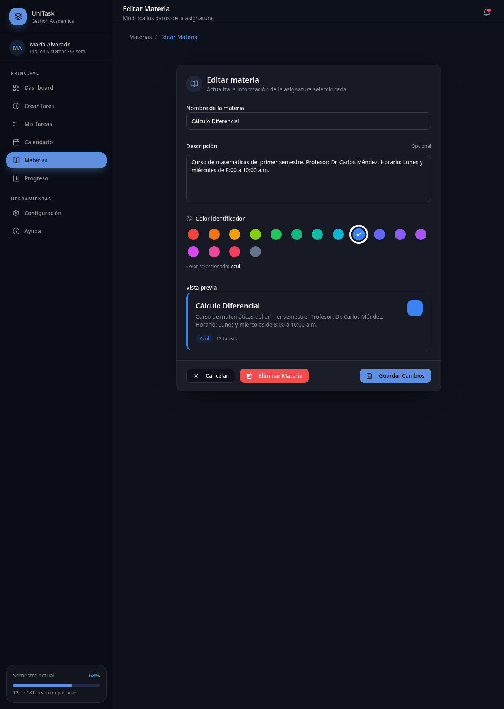

# Especificaciones del proyecto:

Gestión de tareas universitarias

## Problema
Los estudiantes universitarios suelen manejar múltiples asignaturas, talleres, proyectos, exposiciones y actividades académicas al mismo tiempo. En muchos casos utilizan agendas físicas, grupos de mensajería o simplemente la memoria para recordar fechas de entrega, lo que puede generar olvidos, retrasos y bajo rendimiento académico.

Actualmente no existe una herramienta centralizada y sencilla que permita a los estudiantes organizar sus tareas académicas, realizar seguimiento a su progreso y recibir recordatorios oportunos.

Por esta razón se propone desarrollar una aplicación web que permita gestionar tareas universitarias de manera eficiente.

## Stakeholders

Primarios
- Estudiantes universitarios.
Secundarios
- Docentes.
- Coordinadores académicos.
- Instituciones educativas.

## Actores

Estudiante

Puede:

- Crear tareas.
- Editar tareas.
- Eliminar tareas.
- Marcar tareas como completadas.
- Consultar tareas pendientes.
- Visualizar tareas por materia.

## Objetivo y metricas de exito

Objetivo General

Desarrollar una aplicación web que permita a los estudiantes organizar y gestionar sus actividades académicas de manera eficiente.

Métricas de éxito
- El usuario puede crear una tarea en menos de 30 segundos.
- El sistema permite visualizar todas las tareas pendientes desde una sola pantalla.
- El usuario puede identificar las tareas próximas a vencer.
- El sistema permite clasificar tareas por asignatura.
- El usuario puede marcar tareas como completadas correctamente.

## Restricciones

Técnicas
- Aplicación web.
- Base de datos relacional.
- Acceso mediante navegador web.
- Desarrollo durante el semestre académico.

Tiempo
- Entrega dentro del período académico establecido por el curso.

Alcance académico
- Proyecto orientado a fines educativos.

## Alcance
### Incluye

- Registro e inicio de sesión.
- Gestión de materias.
- Creación de tareas.
- Edición de tareas.
- Eliminación de tareas.
- Asignación de fechas límite.
- Clasificación por asignaturas.
- Gestión de estados.
- Visualización de tareas pendientes y completadas.
- Dashboard principal.

### No incluye

- Integración con plataformas universitarias externas.
- Videollamadas.
- Chat entre usuarios.
- Calificaciones automáticas.
- Aplicación móvil.
- Sincronización con calendarios externos.

## Conceptos del dominio

Usuario

- Persona registrada en el sistema.

Materia

- Asignatura asociada al estudiante.

Ejemplos:

- Programación Web
- Bases de Datos
- Ingeniería de Software
- Tarea

Actividad asignada al estudiante.

Ejemplos:

- Taller
- Proyecto
- Exposición
- Quiz

Estado

- Situación actual de la tarea.

Posibles estados:

- Pendiente
- En progreso
- Completada
- Vencida

Fecha Límite

- Fecha máxima para completar una tarea.

## Reglas de negocio

RN-01

Un estudiante debe iniciar sesión para gestionar tareas.

RN-02

Toda tarea debe pertenecer a una materia.

RN-03

Toda tarea debe tener un título.

RN-04

Toda tarea debe tener una fecha límite.

RN-05

Una tarea completada no puede estar en estado pendiente.

RN-06

Las tareas vencidas deben identificarse visualmente.

RN-07

Un estudiante solo puede visualizar sus propias tareas.

## Historias de usuario

HU-01

Como estudiante quiero crear una tarea para organizar mis actividades académicas.

HU-02

Como estudiante quiero editar una tarea para actualizar información incorrecta.

HU-03

Como estudiante quiero eliminar una tarea para mantener mi lista organizada.

HU-04

Como estudiante quiero marcar una tarea como completada para llevar seguimiento de mi progreso.

HU-05

Como estudiante quiero asociar tareas a materias para organizarlas mejor.

HU-06

Como estudiante quiero visualizar mis tareas pendientes para saber qué actividades debo realizar.

HU-07

Como estudiante quiero recibir alertas visuales para identificar tareas próximas a vencer.

## Casos de uso

### UC-01 Iniciar Sesión

Actor: Estudiante

Flujo:

1. Ingresa correo y contraseña.
2. El sistema valida las credenciales.
3. El sistema permite el acceso.

### UC-02 Crear Tarea

Actor: Estudiante

Flujo:

1. Selecciona "Nueva tarea".
2. Ingresa información.
3. Define fecha límite.
4. Selecciona materia.
5. Guarda la tarea.

### UC-03 Modificar Tarea

Actor: Estudiante

Flujo:

1. Selecciona una tarea.
2. Modifica la información.
3. Guarda los cambios.

### UC-04 Completar Tarea

Actor: Estudiante

Flujo:

1. Selecciona una tarea.
2. Marca la tarea como completada.
3. El sistema actualiza el estado.

### UC-05 Consultar Tareas

Actor: Estudiante

Flujo:

1. Accede al dashboard.
2. Visualiza tareas.
3. Filtra por materia o estado.

## Flujo de pantallas

## Propuestas de diseno y mockups

### LOGIN

### DASHBOARD

### TAREAS

## CREAR TAREA

## EDITAR TAREA

### LISTA DE MATERIAS

## CREAR MATERIA

## EDITAR MATERIA

